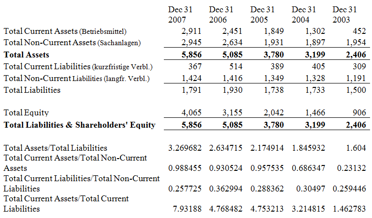

Exercise 1-A2
-------------

What are the three main types of decision a financial manager can make?
For each decision, give a relevant example.

---

Joint Venture between Chrysler and Fiat:

- Investment: to assess the viability of the joint venture
- Finance: How to fund the joint venture
- Liquidity: management (?)

Exercise 2 (1-A3)
-----------------

Evaluate the following statement:
"Managers should not focus on the current share price
because doing so will lead to an overemphasis
on short-term profits at the expense of long-term profits."

---

- this has always been a critisicm of company managers have focused on maximizing share prices because it was linked to their persoanl remuneration
example crunch of 2008
- Some of the banks which where hardest hit had the best share price returns in the years

Exercise 3 (1A6)
----------------

Many companies view a stock market listing as an important objective.

a) Why do you think this is the case?
b) Why do you think Google listed on a stock exchange?

---

a)

- the financicial markets are one of serveral avenues through which companies can access funding
- the financial markets are massive
- cheap source of captial

b)

- Google listed on the stock market because it needed extensive funding at an acceptable price level

Exercise 4 (1-A7)
-----------------

The 2007 annual report for Anglo American plc, the world's leading global
mining company, shows that the firm had € 34.042 billion in non-current assets
and €9.962 billion in current assets. It reported € 11.480 billion in current
liabilities and € 8.665 billion in non-current liabilities. How much has the equity
of Anglo American plc worth?

---

Equity = Total Assets - Total Liabilities = (9.662  + 34.0442) - (11.480 + 8.665) = 23.859 billion

Exercise 5 (1-A8)
-----------------

Anlgo American plc announces that it plans to increase its non-current assets by € 10 billion.
If the company whishes to maintain its ratio of total liabilites to quity, how much long-term debt should it use?

---

- Step 1: Determine liability/equity ratio:

    Liability / Equity = 20.145/23.856 = 0.844

- Step 2: To find the current weightings of debt and quity in the new funding, you must actually calculate a new ratio, liability/assets:

    Liability/total assets = 20.145/44.004 = 0,457799

- Step 3: The debt raised is thus:

    4.5779 billion and equity is 5.4200 billion = 10 billion

- Step 4: Check the new liabilty/equity ratio

    new level of liabilites = 24.7229 billion
    new level of equity = € 29.2810 biollion

- The new ratio is: € 24.7229 billion/29.2810 billion = 0,844 - the same as before

Exercise 6 (1-A10)
------------------

Your company has just purchased a forklift truck, and has two payment options:

(a) pay 10,00 Swedish kroner every meonth for 12 months
(b) pay 1.200.000 swedish kroner at the end of the year

Which option would you choose? Why?

---

The payment of SEK 1,200.000 in 12 months is less because the cash flow is after the mayority of SEK 100,000 monthly payments (Assume the monthly interes rate is 1 percent)

Exercise 7 - assessing the viability of two projects (1-A11)
------------------------------------------------------------

ProjectA Has

- a 25 % chance of loosing 1,000,000,
- a 50 % chance of break even and
- a 25 % chance of making 1,0000,000 profit

ProjectB Has

- a 25 % chance of loosing 2,000,000,
- a 50 % chance of breaking even and
- a 25 % chance of making 2,000,000 profit

Which project should you choose? Why?

---

> ZWEIFELHAFT, da Projekte in der Zukunft liegen.

You would choose the less risky project because both have the same expected value. 
In this case you would choose projectA because the risk of losing and gaining money is less that in project b.

Exercise 8 (1-A14)
------------------

You suddenly own a company that is losing € 100.000 per week.
At the rate things are going the company won't have any cash left in six months to pay creditors.

What are your goals as a financial manager?
Is this consistent with what you habe read in this chapter? Explain!

---

Goals:

- Balance between the short and long term objectives.
- When the company is in trouble short term liquidity becomes more important.
- the objective of the firm will change from maximizing shareholders value to firm survival and bankrupty avoidance
- other options such as asset sell-off can also be undertaken

Exercise 9 (?)
---------------

You have the following information for the British mining firm Antofagasta plc.
All figures are in € millions.

---

- A lot of current assets is relation to it's current liabilits and nun current assess
- furthg investigation would be needed to dertermine what is driving the increade in current asstes
- it loos as if the firm is less rsky
- Current assets could compromise of cash

Exercise 10 (2-A5)
------------------

Explain why the corporate governance of a firm sole propietorship should be differend from that for a partnership, which in turn should be different from a limited corporation.

---

- A sole propietorship does not need formal governanace structures since all
    - busineess activities are concentrated on one induvitual
    - in partnershiip semiformal corp gov structs are present such as a partnership agreement or deed
    - a limite corporation is a separate lele entity and needs corporate gov structs

Exercise 11 (2-A6)
------------------

What are the differences between a general partnership and a limited
partnership? Why do firms choose to be partnerships instead of limited
liability corporations?

---

- In a general partnership all partners agree to provide some fraction of the work and cash and to share the profits and losses.
- Each partner is liable for all of the debts of the partnership.
Limited partnerships permit some of the partners to have limited liability
(liable only to the amount of cash one has contributed to the partnership).
- Limited partnerships usually require that
    (1) at least one partner be a general partner and
    (2) the limited partners do not participate in managing the business.

Exercise 12 (2-A19)
------------------

Why would we expect managers of a corporation to pursue the objectives of
shareholders? What about bondholders? 

---

- In agency theory, the underlying contract between the principal (shareholders) and agent (management) is based on maximising the principal’s wealth.
- We would expect managers to pursue the objectives of shareholders only if their interests are the same as that of the shareholders.
- This can be done through appropriate executive compensation contracts. In most situations, the shareholder and bondholder objectives will be the same.
- However, when a firm is in financial distress, these may differ and then shareholder objectives will naturally take precedence. This is why we have bond indentures.

Exercise 13 - Valuation: The One-Period Case (4-A1)
---------------------------------------------------

Would you be willing to pay € 500 today in exchange for € 525 in one year?
What would be the key considerations in answering yes or no?
Would your answer depend on who is making the promise to repay?

---

Exercise 14 - Compounding Periods (4-A3)
----------------------------------------

As you increase the length of time involved, what happens to future values?
What happens to present values?
What happens to the future value of an annuity if you increase the rate r?
What happens to the present value?

---

Exercise 15 - Calculating Future Values (4-A7)
----------------------------------------------

In the UK, every child born after 1 September 2002 receives a € 250 voucher from the government that they cannot touch until they reach the age of 18.
Assume that the growth rate o the funds is 3.5 per cent (this is what the British government suggests):

How much will your child have at the abe of 18?

Exercise 16 - Calculating present values (4-A8)
-----------------------------------------------

In 2008, British Airways had a pension liability of € 330 million.

Let's assume it must be paid in 30 years' time.

To assess the value of the firm's shares, financial analysts want to discount this
liability back to the present.

If the relevant discount rate is 5.6 per cent, what is the present value of this liability?

---

Exercise 17 - Calculating Rates of Return (4-A9)
------------------------------------------------

On 8 February 2009 John Majeski, chairman of Reading Football Club, sold the Edgar Degas bronze sculpture Petite  Danseuse de Quatorze Ans at auction for a world record price of € 13.3 million.

He bought the statue in 2004 for € 5 million. What was his annual rate of return on this sculpture?

Exercise 18 - Interest (4-A6)
-----------------------------

You work for a jewellers and have sourced a good goldsmith who is  able to sell you 100 ounces of gold for one million rand.
You approach your two main customers. Mr Martyn says he will buy the gold from you in six months for R 1,040,000, whereas Ms Kuchner tells you that she will be able to buy the gold from you in two years’ time for R1,160,000.
What is the annual percentage rate that Mr Martyn and Ms Kuchner are offering you? Which option should you go for?

Exercise 19 - Perpetuities (4-A10)
----------------------------------

An investor purchasing a British consol is entitled to receive annual payments from the British government for ever.
What is the price of a consol that pays € 4 annually if the next payment occurs one year from today?
The market interest rate is 3 per cent.

Exercise 20 - Net Present Value / NPV (4-A12)
---------------------------------------------

FIFA rules regarding players contracts are very interesting.
If a player whishes to break his contract, the pruchasing club must pay the players's club four times the player's annual salary multiplied by the number of years left onb the contract.

The player must pay 10 per cent of this amount personally,
and the agent must also pay 10 per cent of the amount from his own pocket.

Consider the footballer Cristiano Ronaldo, who was widely rumored to be leaving Manchester United for Real Madrid during the summer of 2008 (he acutally joined in the summer of 2009).

At the time Ronaldo was earning € 120,000 a week, and had four years of his contract with Manchester United left.

a) Calculate how much Ronaldo would have personally had to pay Manchester United if he left with 4 years remainung, 3 years remaining, 2 years remaining and 1 year remaining!
b) If the appropriate annulized discount rate is 8 per cent, what is the present value to Ronaldo of breaking his contract with 4, 3, 2, 1 and 0 years remaining?
c) Assume you are Ronaldo's agent and can personally earn € 5 million today from getting  Ronaldo to sign a pre-contract agreement to join Real Madrid in the future.
d) Calculate the net present value to you if Ronaldo left with 4 years remaining, 3 years remainung, 2 years remaining and 1 year remaining.

Exercise 21 - Future Value (4-A16)
----------------------------------

What is the future value in four years of € 1,000 invested in an account stated annual interest rate of 10 per cent:

a) Compounded annually?
b) Compounded semi-annually?
c) Compounded monthly?
d) Compounded continuously?
e) Why does the future value increase as the compounding period shortens? 

---

