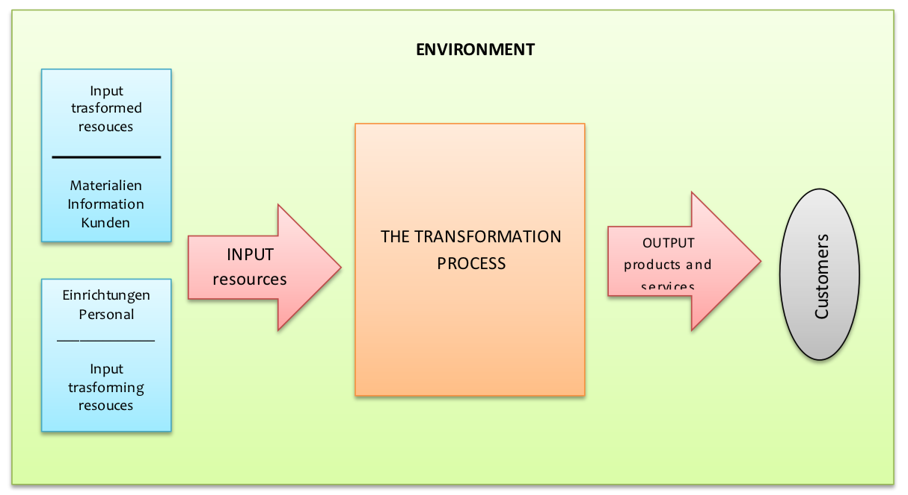
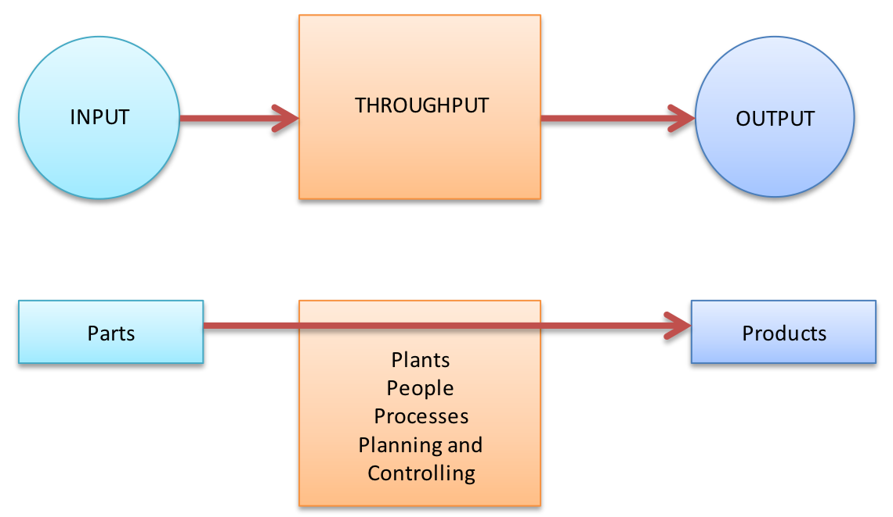
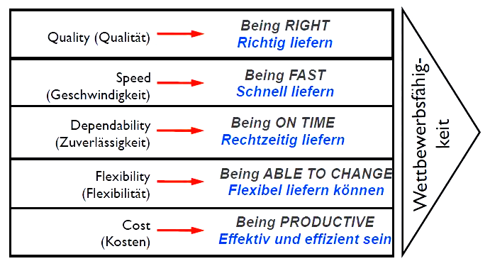
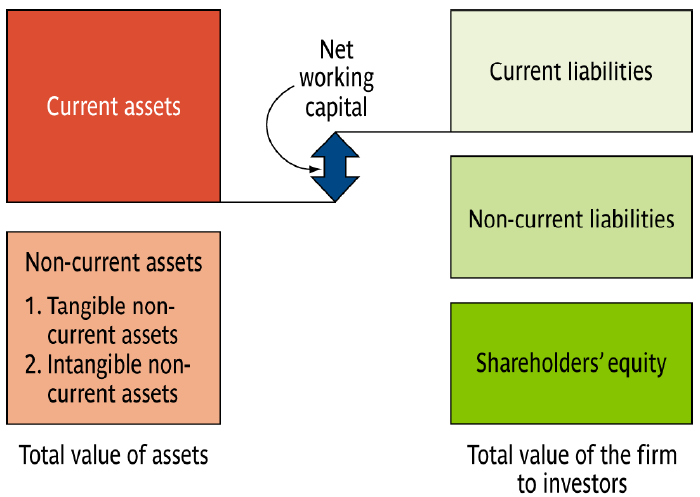
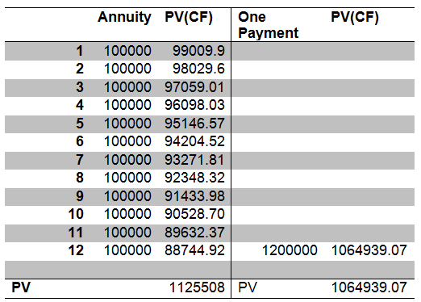
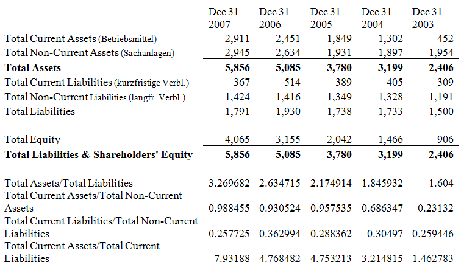

Allgemeine Klausurtipps
=======================

Definitionen ziemlich direkt auswendig lernen.

- Supply Chain
- Supply Chain Management
- Focal Company

Net-Present-Value: Zu einfach, um in der Klasur dran zukommen

Formelsammlung
==============

?

Vorwort
=======

Im Folgenden aufgabenweise die Übungen, zum Bearbeitenden nützliche Informationen und Lösungen.

--------------------------------------------------------------------------------

Produktion
==========

**Sachziel** eines Unternehmens ist die Herstellung von Sachgütern und
Dienstleistungen. Dieses Sachziel wird in vier Leistungsbereiche segmentiert:

- **Beschaffung**: Versorgung des UN mit Roh-, Hilfs- und Betriebsstoffen
sowie Personal.
- **Produktion**: Erzeugung der Produkte aus Beschafftem durch
Faktorkombination.
- **Absatz**: Maßnahmen zum Verkauf erstellter Leistungen.
- **Logistik**: Alle Transport-, Lager- und Umschlagvorgänge im oder zwischen
UN.

Produktionsmanagement / Operations management
---------------------------------------------

- das Managen von Produktionsprozessen.
- design, operation and improvement of a system that creates and delivers a firm's primary products or services
- activities, decisions and responsibilities of operations managers.
- umfasst vier Elemente industrieller Wertschöpfungs- und Leistungserstellungsprozesse:
    - Planung,
    - Organisation,
    - Durchsetzung und
    - Kontrolle.

Produktionsprozesse stehen im Produktionsmanagement im Vordergrund. Man kann das Produktionsmanagement als Kombination von Produktionsfaktoren zum Zwecke der Erstellung von Sach- und Dienstleistungen auffassen.

Wirkung von PM
--------------

Produktionsmanagement ist wichtig für ein Unternehmen, denn es schafft diverse Vorteile für die Firma:

- Produktionsmanagement reduziert die Produktionskosten, durch seine Effizienz.
- Produktionsmanagement erhöht die Gewinne/Einnahmen durch die Erhöhung von Zufriedenheit der Kunden.
- Produktionsmanagement kann auch die Investitionsbedurfnisse reduzieren.
- Produktionsmanagement kann Innovationen durch den Aufbau einer Wissensinfrastruktur vorantreiben.

--------------------------------------------------------------------------------

Modell des Input-Transformation-Output
--------------------------------------

Alle Prozesse im UN lassen sich als Transformationsprozess nach Input-Transformation-Output-Modell auffassen:

1. Der Transformationsprozess nimmt zwei Typen von Input-Faktoren als Inputset auf:
    a) **Transformed Ressources** werden im Laufe des Throughputsprozesses abgeändert.  
    z.B. Materialien, Information und Kunden.
    b) **Transforming Ressources** nehmen an Abänderung von Transformed Ressources teil.  
    z.B. Maschinen und Personal.
2. Im Throughput- oder Transformation-Process-Set werden die Transformed Resources abgeändert.
3. Die entstandenen Produkte und Dienstleistungen sind der Output des Transformationsprozesses und werden an Kunden abgegeben.

Alle Produktionsprozesse erzeugen Produkte oder/und Dienstleistungen.
Oft ist es schwierig Produkte von Dienstleistungen abzugrenzen.

--------------------------------------------------------------------------------

Das I-T-O-Model lässt sich auch auf die Entscheidungsfelder des Produktionsmanagement übertragen:

Diese **5 Entscheidungsfelder des Produktionsmanagement** erzielen das Erreichen der
Leistungsfähigkeitsgrenze und das Sicherstellen eines schnellen und flüssigen
Material- und Informationsflusses.

Alle Produktionsprozesse ähneln sich indem sie für die Umwandlung des Inputs in Outputs sorgen, sie unterscheiden sich aber in manchen Parametern, weil sie unterschiedliche Charakteristika haben.

4 Vs - Typologisierung von Produktionsprozessen
-----------------------------------------------

- **Volume** - Produktionsvolumen
- **Variety** - Produktionsflexibilität
- **Variation** - Mengenschwankungen
- **Visibility** - Einbindung des Kunden (bei der Produktion)

Leistungsziele des Produktionsmanagement
----------------------------------------

--------------------------------------------------------------------------------

Investition / Finanzierung - Inhalte
====================================

Grundlagen der Investitionsrechnung
-----------------------------------

Investitionsrechnungen sind Methoden, mit denen die erwarteten Konsequenzen von Investitionen in Bezug auf quantifizierbare Interessen beurteilt werden können.
Demnach liefern diese Verfahren Entscheidungshilfen bei der Beurteilung konkreter Investitionsvorhaben.
Ziel der Investitionsrechnung ist die optimale Nutzung zur Verfügung stehender Geldmittel; die Investitionsrechnung folgt somit dem Prinzip der Gewinnmaximierung.

„Investition“ ist der zentrale Begriff der Investitionsrechnung. Es gibt allerdings keine feste Definition dieses Begriffs.
Die gängige Definition ist: Investition ist das Anlegen von Geldmitteln, wobei aus
freiem Kapital gebundenes Kapital wird.
Man gibt quasi dem Kapital durch Investition eine andere Erscheinungsform.
Das Wort „Investition“ kann sowohl eine Handlung (die Tätigkeit des
Investierens) als auch ein Objekt (das Ergebnis des Investierens) kennzeichnen.
Außerdem kann der Investitionsbegriff wie folgt gegliedert werden:

- Gliederung nach Objekt:
    - Realinvestition:
        - Erhaltung,
        - Erweiterung oder
        - Verbesserung des betrieblichen Produktionsprozesses.
    - Finanzinvestition:
        - Erwerb von Forderungen oder
        - Beteiligungsrechten
    - Immaterielle Investition:
        - Auszahlung zu Forschungs- oder
        - Entwicklungszwecken,
        - Erwerb von Patenten.
- Gliederung nach Zielsetzung:
    - Errichtungsinvestition
    - Ersatzinvestition
    - Rationalisierungsinvestition
    - Sozialinvestition
    - Sicherheitsinvestition

- Chronologische Gliederung
    - Gründungsinvestition
    - Laufende Investition

Wichtig ist es zu betonen, dass Investitionen oft mit mehreren Zielsetzungen verbunden sind.

Beispiel - Palettenwickler
--------------------------

> Ein Lebensmittelgroßhandel erwägt die Anschaffung eines Palettenwicklers. Bisher
wurden die Paletten manuell mit Folie umwickelt.

Wenn man jetzt das Investitionsvorhabens einordnen wollen würde, dann würde man zu folgenden Ergebnis kommen:

- Es ist eine Realinvestition, wegen dem Bezug zur betrieblichen Leistungserstellung (Verpacken von Handelsgütern)
- Die Investition ist laufend, da der Betrieb offensichtlich schon
existiert.
- Es ist eine Rationalisierungsinvestition, wegen der Einsparung von Arbeitskräften.

Investitionen als Entscheidungsprobleme
---------------------------------------

Es gibt 4 typische investitionsbezogene unternehmerische Entscheidungsprobleme:

- Absolute Vorteilhaftigkeit: Soll ich diese Investition durchführen oder nicht?
- Rangfolgenermittlung: Welches der Investitionsvorhaben soll bevorzugt behandelt werden?
- Relative Vorteilhaftigkeit/Alternativvergleich: Welcher der beiden konkurrierenden Vorhaben ist vorteilhafter?
- Ersatzproblem: Soll diese Altanlage jetzt ersetzt werden oder ist sie noch ein Jahr weiterzubetreiben?

Man unterscheidet auch zwischen Brutto- und Nettoinvestitionen
Laut Kruschwitz ist Investition eine betriebliche Tätigkeit, die zu unterschiedlichen Zeitpunkten t Aus- und Einzahlungen verursacht, wobei dieser Vorgang immer mit einer Auszahlung beginnt.

Man soll auch zwischen folgenden Investitionsrechnung unterscheiden:

- Methoden der Partialmodelle
    - Statische Verfahren sind einperiodige Verfahren.
    Sie rechnen mit Schätzwerten für eine repräsentative Periode über die Nutzungsdauer der Investition.
    Statische Methoden sind ungenau und „chronologisch agnostisch“, dafür sind sie aber einfach und können auch auf einem Bierdeckel durchgeführt werden.    
        - Kostenvergleich
        - Gewinnvergleich
        - Rentabilitätsrechnung
        - Amortisationsrechnung
        - Dynamische Verfahren sind mehrperiodige Verfahren. Bei dieser Methode werden spezifische Ein- und Auszahlungen für jede einzelne Periode der Nutzungsdauer zur Grunde gelegt. Berücksichtigen die Höhe und den Zeitpunkt jeder einzelnen Zahlung. Diese Verfahren basieren auf Verfahren der Finanzmathe.
        - Kapitalwertmethode
        - Interner Zinsfuß
        - Annuitätenmethode
        - Dynamische Amortisationsrechnung
- Programmplanung

Wichtiger Schritt in der Investitionsrechnung ist der Kalkulationszinssatz.
Ohne sein Festlegen kann keine Investitionsrechnung durchgeführt werden.
Der Kalkulationszinssatz beschreibt die Mindestverzinsungsanforderung, die an ein Investitionsobjekt gestellt ist.
Aufgrund dieses Zinssatzes kann ein Investitionsvorhaben dann mit verschiedenen Verfahren kalkuliert werden.

Bei der Festlegung des Kalkulationszinssatzes ist es wichtig zu berücksichtigen, dass der Kalkulationszinssatz nicht niedriger als der Zinssatz einer möglichen Kapitalmarktanlage sein darf.
Außerdem darf er auch nicht niedriger als der Sollzinssatz der Finanzierung sein. Der Kalkulationszinssatz ist eine subjektive Größe, es existieren aber mögliche objektive Untergrenzen (Kapitalmarkt).

In der Praxis werden oft die Aufschläge auf den Kalkulationszinssatz vorgenommen. Diese Aufschläge hängen vom geschätzten Risiko ab - je riskanter die Investition erscheint, desto höher der zugrunde gelegte Kalkulationszinssatz. Dieses Verfahren ist üblich, weil die Investitionsrechnung meist auf Prognosen der erwarteten Zahlungen basiert. Der Eintritt dieser Prognose ist mehr oder
weniger unsicher.

Statische Verfahren der Investitionsrechnung
--------------------------------------------

Die Kostenvergleichsrechnung vergleicht die durchschnittlich anfallenden Jahreskosten von verschiedenen Investitionsobjekten.
Sie nimmt keine Rücksicht auf die Ertragsseite oder die Kapazität der Anlagen, deswegen kann man mit der Kostenvergleichsrechnung nur Investitionsobjekte gleicher Kapazität vergleichen.

Die Kostenvergleichsrechnung hat 2 Anwendungsfälle:

- Relative Vorteilhaftigkeit/Alternativvergleich
- Ersatzproblem

Relative Vorteilhaftigkeit/Alternativvergleich
----------------------------------------------

Die Investition mit den geringsten durchschnittlichen Kosten pro
Periode wird gewählt.

Bei dem Begriff „Kosten“ unterscheidet man zwischen Kapital- und
Betriebskosten.
Kapitalkosten sind die kalkulatorische Abschreibungen und die kalkulatorische Zinsen.
Zu den Betriebskosten gehören Personalkosten, Fertigungsmaterialkosten,
Energiekosten, Raumkosten etc.

Berechnung der Kapitalkosten (Ingenieurformel)
----------------------------------------------

Die Ingenieurformel setzt sich aus AfA- und Zinskosten-Formeln
zusammen. Diese Formel berechnet einen durchschnittlichen
Kapitaldienst pro Periode:

$\frac{A - R}{n} + \frac{A + R}{2} \cdot i$

Kalkulatorische Abschreibung berechnet man mit der Formel:

$AfA = \frac{A}{n}, R = 0$

bzw.

$AfA = \frac{A - R}{n}, R \neq 0$

- AfA: Aufwendung für Abschreibungen (pro Periode)
- A: Anschaffungsauszahlung
- R: Restwert
- n: Nutzungsdauer

Für die Berechnung der durchschnittlichen Zinskosten pro Periode
benötigt man:

- Das durchschnittlich gebundene Kapital, $DGK = \frac{A + R}{2}$

- Den Kalkulationssatz i

Demnach ist die Formel für die Berechnung der Zinskosten pro Periode:

$DGK \cdot i = \frac{A + R}{2} \cdot i$

Um die Aussagen über die Vorteilhaftigkeit der Alternative machen zu können, berechnet man die Summe aus den Kapital- und Betriebskosten für jede Alternative. 
Die Alternative mit kleineren Summen ist vorzuziehen.

$B_A + K_A < B_B + K _B$

Ersatzproblem
-------------

Durch den Ersatz einer Altanlage fallen die Betriebskosten der Alten Anlage weg - die Kapitalkosten jedoch fallen weiter an.

Die Altanlage ist zu ersetzen, wenn die gesamten Kosten der Neuanlage geringer sind als die Betriebskosten der Altanlage.

$B_neu + K_neu + K_alt < B_alt + K_alt$

also 

$B_neu + K_neu < B_alt$

Kritik der Kostenvergleichsrechnung
-----------------------------------

- Kostenvergleichsrechnung macht keine Aussagen darüber, ob eine Investition überhaupt vorteilhaft ist.
- Unterschiedlicher zeitlicher Anfall von Zahlungsgrößen bleibt unberücksichtigt.
- Kein sinnvoller Umgang mit Differenzen der Nutzungsdauer, daher nur bei gleicher Nutzungsdauer „erlaubt“.
- Ein unterschiedlicher Kapitaleinsatz wird nicht explizit berücksichtigt.

Berechnung kritischer Menge
---------------------------

Bei dieser Berechnung stellt sich die Frage:
Wann lohn sich der Übergang zu einem anderen Verfahren mit höheren Fixkosten, aber geringeren variablen Kosten?

- Fixkosten sind nicht kurzfristig abzubauen. Sie hängen nicht von der
Auslastung einer Anlage ab. Siehe: Kapitalkosten.
- Variable Kosten sind kurzfristig abbaubar und stehen im direkten
Zusammenhang mit einer Auslastung einer Anlage. Siehe: Materialkosten

Um die kritische Menge zu berechnen, benötigen wir die Kostenfunktionen der beiden Alternativen.

- x: benötigte Menge pro Jahr
- K(x) Gesamtkosten pro Jahr in Abhängigkeit von der Menge x
- Fremdbezug: KF(x) = 20x
- Eigenfertigung: KE(x) = durchschnittliche Kapitalkosten + 10x

Die kritische Menge wird durch Gleichsetzung der Kostenfunktionen
berechnet.

> Formel?

Amortisationsrechnung
---------------------

- Frage: Nach wie vielen Jahren macht sich bezahlt?
- Entscheidungskriterium: kürzeste Amortisationsdauer.

Kritik an die statischen Verfahren
----------------------------------

- Kapiteldienst wird nur überschlägig berücksichtigt
- „repräsentative Periode“ vernachlässigt zeitlichen Anfall verschieden hoher Zahlungen

Wann ist eine rein statische Betrachtungsweise noch vertretbar?

- Investitionsvolumen ist überschaubar (< 20000€)
- Erwartete Eizahlungsüberschüsse sind schwer abzuschätzen
- Erwartete Zahlungen schwanken kaum
- Laufzeiten sind gering (2-3 Jahre)
- Kalkulationssatz ist niedrig
- Keine Kapazitätsänderungen

Kapitalwertmethode
------------------

Die Vorteilhaftigkeit einer Investition wird geprüft, indem alle mit der Investition verbundenen Ein- und Auszahlungen auf den Beginn der Laufzeit abgezinst werden, um sie ihrer Gesamtheit miteinander zu vergleichen.
Ein sinnvoller kalkulatorischer Zinssatz wird hier dringend benötigt.

Aufzinsen einer Zahlung
-----------------------

Ein Geldbetrag $K_0$ wird zum Zinssatz $i$ für $n$ Jahre angelegt. Zinsen
werden dem angelegten Kapital zum Ende jeder Periode zugeschlagen.

$K_n = K_0 (1 + i)^n$ , wobei $(1 + i)^n$ ein Aufzinsfaktor ist.

Abzinsen einer Zahlung
----------------------

Wenn gilt $K_n = K_0(1 + i)^n$,  
dann gilt auch $K_0 = K_n(1 + i)^{-n}$ oder $K_0 = \frac{K_n}{(1 - i)^n}$; wobei $K_n (1 + i)^{-n} der Abzinsungsfaktor ist.

Endwertfaktor (EWF)
-------------------

Rente ist eine Folge der gleichen Einzahlungen. Man kann sowohl den Gegenwartswert (Barwert) und den Endwert einer Rente berechnen.

$K_n = e \cdot \frac{(1 + i)^n - 1}{i}$

Wobei $\frac{(1 + i)^n - 1}{i}$ ein EWF ist

Barwert

$K_0 = e \cdot \frac{(1 + i) ^n - 1}{i \cdot (1 + i)^n}$

Wobei $\frac{(1 + i) ^n - 1}{i \cdot (1 + i)^n}$ BWF oder DSF ist.

Produktion - Aufgaben
=====================

Tutorium 5 Aufgabe 1 - Materialwirtschaft (5 Punkte)
----------------------------------------------------

a) Was sind die grundlegenden Aufgaben der Materialwirtschaft/Beschaffung?
(2 Punkte)
b) Was ist das Ziel der Materialwirtschaft? Gehen Sie bitte dabei auf die drei
wesentlichen Komponenten ein! (3 Punkte)

---

Tutorium 5 Aufgabe 2 - Optimale Bestellmenge (10 Punkte)
--------------------------------------------------------

Die Asterix Computer GmbH kauft pro Jahr 8.000 Prozessoren als Komponenten für
Computer ein. Jeder Prozessor kostet € 10. Für die Lagerhaltung fallen pro Jahr € 3
pro Prozessor an. Eine Bestellung verursacht Kosten in Höhe von € 30. Das
Unternehmen produziert an 200 Tagen im Jahr.
a) Geben Sie zuerst die Formel für die Gesamtkosten der Beschaffung mit
ihren Einzelbestandteilen an! (2 Punkte)
b) Leiten Sie daraus die Formel für die Optimale Bestellmenge ab und
berechnen Sie diese! (2Punkte)
c) Wie viele Bestellungen werden damit pro Jahr vorgenommen und nach wie
vielen Arbeitstagen wird wieder eine Bestellung vorgenommen? (2 Punkte)
d) Nennen Sie vier Voraussetzung, die für die Anwendung der Formel zur
Optimalen Bestellmenge erfüllt sein müssen! (4 Punkte)

---

Tutorium 5 Aufgabe 3 - Optimale Bestellmenge (8 Punkte)
-------------------------------------------------------

Ein Motorradhersteller benötigt pro Jahr 90.000 Reifen zu einem Preis von 20 Euro
pro Stück. Pro Bestellvorgang beim Reifenlieferanten fallen fixe Kosten von 100 Euro
an. Als Lagerkostensatz werden 7% und als Zinskostensatz 3% pro Jahr auf den
durchschnittlich gebundenen Wert angenommen.
a) Geben Sie zuerst die Formel für die Gesamtkosten der Beschaffung mit
ihren Einzelbestandteilen an! (2 Punkte)
b) Berechnen Sie auf Grundlage dieser Gesamtkostenformel, wie hoch die
optimale Bestellmenge ist, wie hoch die Gesamtkosten sind und wie viele
Bestellungen das Unternehmen pro Jahr durchführen sollte. (6 Punkte)

---

a) K = B*p + Kf*B*m^-1 + (m/2)*p*q

b) K' = B*p + Kf*B/m + (m/2)*p*q dm
K' = 0 - Kf*B/m^2 + p*q/2 = 0 -> Umformen: | -p*q/2 | *(-1) | *m2 |*2/pq | wurzelziehen
-> Wurzel aus 2*Kf*B/p*q = mopt
-> Einsetzen der Werte in mopt -> mopt = Wurzel aus 2*100*90.000/20*0,1 = 3.000 (optimale Bestellmenge)
-> Gesamtkosten K = 90.000*20 + 100*90.000/3000 + 3000/2*20*0,1 = 1.806.000
-> Bestellungen pro Jahr B/mopt = 90.000/3.000 = 30

Tutorium 5 Aufgabe 4 - ABC-Analyse (4 Punkte)
---------------------------------------------

a) Erläutern Sie, was eine ABC-Analyse ist. (2 Punkte)
b) Welche Formen der Materialbedarfsermittlung gibt es und für welches Gut
sind sie geeignet (A, B oder C-Gut)? (2 Punkte)

Tutorium 5 Aufgabe 5 - Just-in-Time (6 Punkte)
----------------------------------------------

a) Beschreiben Sie die Ziele des Just-in-Time Konzeptes (2 Punkte).
b) Welche Anforderungen bedarf das Just-in-Time Konzept? (2 Punkte)
c) Nennen Sie zwei Probleme/Risiken einer Just-in-Time-Anlieferung. (2
Punkte)

---

Investition / Finanzierung - Aufgaben
=====================================

Exercise 1 - three main decision types of financial management (1-A2)
---------------------------------------------------------------------

What are the three main types of decision a financial manager can make?
For each decision, give a relevant example.

---

Joint Venture between Chrysler and Fiat:

- Investment: to assess the viability of the joint venture
- Finance: How to fund the joint venture
- Liquidity: management (?)

Exercise 2 (1-A3)
-----------------

Evaluate the following statement:
"Managers should not focus on the current share price
because doing so will lead to an overemphasis
on short-term profits at the expense of long-term profits."

---

- this has always been a critisicm of company managers have focused on maximizing share prices because it was linked to their persoanl remuneration
example crunch of 2008
- Some of the banks which where hardest hit had the best share price returns in the years

Exercise 3 (1A6)
----------------

Many companies view a stock market listing as an important objective.

a) Why do you think this is the case?
b) Why do you think Google listed on a stock exchange?

---

a)

- the financicial markets are one of serveral avenues through which companies can access funding
- the financial markets are massive
- cheap source of captial

b)

- Google listed on the stock market because it needed extensive funding at an acceptable price level

--------------------------------------------------------------------------------

Exercise 4 - Calculating Equity (1-A7)
--------------------------------------

The 2007 annual report for Anglo American plc, the world's leading global
mining company, shows that the firm had € 34.042 billion in non-current assets
and €9.962 billion in current assets. It reported € 11.480 billion in current
liabilities and € 8.665 billion in non-current liabilities. How much has the equity
of Anglo American plc worth?

---

    "Eine Bilanz zeigt auf der rechten Seite das Kapital, das einem Unternehmen zur Verfügung steht (Passiva). Auf der linken Seite zeigt sie, in welcher Form dieses Kapital im Unternehmen vorhanden ist (Vermögenswerte, Aktiva). Die Summe der linken Seite muss daher stets den gleichen Wert wie die Summe der rechten Seite ergeben." - Wikipedia, Bilanzsumme

    "[...] equity is the residual claim or interest of the most junior class of investors in assets, after all liabilities are paid." - Wikipedia, equity

$Equity = Total\ Assets - Total\ Liabilities$

---
  
$Equity = (9.662  + 34.0442) - (11.480 + 8.665) = 23.859\ billion$

Exercise 5 (1-A8)
-----------------

Anlgo American plc announces that it plans to increase its non-current assets by € 10 billion.
If the company whishes to maintain its ratio of total liabilites to equity, how much long-term debt should it use?

---

- Step 1: Determine the current liability/equity ratio:

    $\frac{Liability}{Equity} = \frac{20.145}{23.856} = 0.844$

- Step 2: To find the current weightings of debt and equity in the new funding, you must actually calculate a new ratio, liability/assets:

    Liability/total assets = 20.145/44.004 = 0,457799

- Step 3:

    The debt raised is thus 4.5779 billion and
    equity is 5.4200 billion = 10 billion

- Step 4: Check the new liabilty/equity ratio

    new level of liabilites = 24.7229 billion  
    new level of equity = € 29.2810 biollion

- Step 5: Verification
    
    The new ratio is: € 24.7229 billion/29.2810 billion = 0,844 - the same as before

Exercise 6 (1-A10)
------------------

Your company has just purchased a forklift truck, and has two payment options:

(a) pay 10,00 Swedish kroner every meonth for 12 months
(b) pay 1.200.000 swedish kroner at the end of the year

Which option would you choose? Why?

---

The payment of SEK 1,200.000 in 12 months is less because the cash flow is after the mayority of SEK 100,000 monthly payments (Assume the monthly interes rate is 1 percent)

Exercise 7 - assessing the viability of two projects (1-A11)
------------------------------------------------------------

ProjectA Has

- a 25 % chance of loosing 1,000,000,
- a 50 % chance of break even and
- a 25 % chance of making 1,0000,000 profit

ProjectB Has

- a 25 % chance of loosing 2,000,000,
- a 50 % chance of breaking even and
- a 25 % chance of making 2,000,000 profit

Which project should you choose? Why?

---

> ZWEIFELHAFT, da Projekte in der Zukunft liegen.

You would choose the less risky project because both have the same expected value. 
In this case you would choose projectA because the risk of losing and gaining money is less that in project b.

Exercise 8 (1-A14)
------------------

You suddenly own a company that is losing € 100.000 per week.
At the rate things are going the company won't have any cash left in six months to pay creditors.

What are your goals as a financial manager?
Is this consistent with what you habe read in this chapter? Explain!

---

Goals:

- Balance between the short and long term objectives.
- When the company is in trouble short term liquidity becomes more important.
- the objective of the firm will change from maximizing shareholders value to firm survival and bankrupty avoidance
- other options such as asset sell-off can also be undertaken

--------------------------------------------------------------------------------

Exercise 9 (1-A21)
------------------

You have the following information for the British mining firm Antofagasta plc.
All figures are in € millions.

Give a brief interpretation of what you think Antofagasta plc did over the period
2003-2007. Do you think it is in a better position now than in 2003?

---

- A lot of current assets is relation to it's current liabilits and nun current assess
- furthg investigation would be needed to dertermine what is driving the increade in current asstes
- it loos as if the firm is less rsky
- Current assets could compromise of cash

Exercise 10 (2-A5)
------------------

Explain why the corporate governance of a firm sole propietorship should be differend from that for a partnership, which in turn should be different from a limited corporation.

---

- A sole propietorship does not need formal governanace structures since all
    - busineess activities are concentrated on one induvitual
    - in partnershiip semiformal corp gov structs are present such as a partnership agreement or deed
    - a limite corporation is a separate lele entity and needs corporate gov structs

Exercise 11 (2-A6)
------------------

What are the differences between a general partnership and a limited
partnership? Why do firms choose to be partnerships instead of limited
liability corporations?

---

- In a general partnership all partners agree to provide some fraction of the work and cash and to share the profits and losses.
- Each partner is liable for all of the debts of the partnership.
Limited partnerships permit some of the partners to have limited liability
(liable only to the amount of cash one has contributed to the partnership).
- Limited partnerships usually require that
    (1) at least one partner be a general partner and
    (2) the limited partners do not participate in managing the business.

Exercise 12 (2-A19)
------------------

Why would we expect managers of a corporation to pursue the objectives of
shareholders? What about bondholders? 

---

- In agency theory, the underlying contract between the principal (shareholders) and agent (management) is based on maximising the principal's wealth.
- We would expect managers to pursue the objectives of shareholders only if their interests are the same as that of the shareholders.
- This can be done through appropriate executive compensation contracts. In most situations, the shareholder and bondholder objectives will be the same.
- However, when a firm is in financial distress, these may differ and then shareholder objectives will naturally take precedence. This is why we have bond indentures.

Exercise 13 - Valuation: The One-Period Case (4-A1)
---------------------------------------------------

Would you be willing to pay € 500 today in exchange for € 525 in one year?
What would be the key considerations in answering yes or no?
Would your answer depend on who is making the promise to repay?

---

Exercise 14 - Compounding Periods (4-A3)
----------------------------------------

As you increase the length of time involved, what happens to future values?
What happens to present values?
What happens to the future value of an annuity if you increase the rate r?
What happens to the present value?

---

Exercise 15 - Calculating Future Values (4-A7)
----------------------------------------------

In the UK, every child born after 1 September 2002 receives a € 250 voucher from the government that they cannot touch until they reach the age of 18.
Assume that the growth rate o the funds is 3.5 per cent (this is what the British government suggests):

How much will your child have at the abe of 18?

Exercise 16 - Calculating present values (4-A8)
-----------------------------------------------

In 2008, British Airways had a pension liability of € 330 million.

Let's assume it must be paid in 30 years' time.

To assess the value of the firm's shares, financial analysts want to discount this
liability back to the present.

If the relevant discount rate is 5.6 per cent, what is the present value of this liability?

---

Exercise 17 - Calculating Rates of Return (4-A9)
------------------------------------------------

On 8 February 2009 John Majeski, chairman of Reading Football Club, sold the Edgar Degas bronze sculpture Petite  Danseuse de Quatorze Ans at auction for a world record price of € 13.3 million.

He bought the statue in 2004 for € 5 million. What was his annual rate of return on this sculpture?

Exercise 18 - Interest (4-A6)
-----------------------------

You work for a jewellers and have sourced a good goldsmith who is  able to sell you 100 ounces of gold for one million rand.
You approach your two main customers. Mr Martyn says he will buy the gold from you in six months for R 1,040,000, whereas Ms Kuchner tells you that she will be able to buy the gold from you in two years' time for R1,160,000.
What is the annual percentage rate that Mr Martyn and Ms Kuchner are offering you? Which option should you go for?

---

Nachgereichte Ergebnisse:

> 0.008 bzw. 8 %

Exercise 19 - Perpetuities (4-A10)
----------------------------------

An investor purchasing a British consol is entitled to receive annual payments from the British government for ever.
What is the price of a consol that pays € 4 annually if the next payment occurs one year from today?
The market interest rate is 3 per cent.

Exercise 20 - Net Present Value / NPV (4-A12)
---------------------------------------------

FIFA rules regarding players contracts are very interesting.
If a player whishes to break his contract, the pruchasing club must pay the players's club four times the player's annual salary multiplied by the number of years left onb the contract.

The player must pay 10 per cent of this amount personally,
and the agent must also pay 10 per cent of the amount from his own pocket.

Consider the footballer Cristiano Ronaldo, who was widely rumored to be leaving Manchester United for Real Madrid during the summer of 2008 (he acutally joined in the summer of 2009).

At the time Ronaldo was earning € 120,000 a week, and had four years of his contract with Manchester United left.

a) Calculate how much Ronaldo would have personally had to pay Manchester United if he left with 4 years remainung, 3 years remaining, 2 years remaining and 1 year remaining!
b) If the appropriate annulized discount rate is 8 per cent, what is the present value to Ronaldo of breaking his contract with 4, 3, 2, 1 and 0 years remaining?
c) Assume you are Ronaldo's agent and can personally earn € 5 million today from getting  Ronaldo to sign a pre-contract agreement to join Real Madrid in the future.
d) Calculate the net present value to you if Ronaldo left with 4 years remaining, 3 years remainung, 2 years remaining and 1 year remaining.

Exercise 21 - Future Value (4-A16)
----------------------------------

What is the future value in four years of € 1,000 invested in an account stated annual interest rate of 10 per cent:

a) Compounded annually?
b) Compounded semi-annually?
c) Compounded monthly?
d) Compounded continuously?
e) Why does the future value increase as the compounding period shortens? 

---

FP = PV (1 + r)^T

a) annualy
FV = 1000 (1 + 0.1)^4 = 1,464.10 €

b) semi-annually
$FV = 1000 (1  + 0.1/2)^(4\cdot2)$

c) monthly
$FV = 1000 (1 + 0.1 /12)^(4 \cdot 12)$

d) continuusly

$FV = PV ^(eT)$

Exercise 22 - (4A18)
--------------------

a) What is the annualized interest rate, compounded daily, that is equivalent to 12
per cent interest compounded semi-annually?
b) What is the daily compounded rate that is equivalent to 12 per cent compounded continuously?

---

- semi-annually - twice a year
- quarterly - 4 times a year
- monthly - 12 times a year
- weekly - 52 times a year
- daily - 365 times a yeear
- continuous

$FV = C (1 + \frac{r}{m})$

---

a)

$(1 + \frac{r}{365})^{365} = (1 + (0.12/2))^2$  
$(1 + \frac{r}{365})^{365} = 1.1236$  
$1 + \frac{r}{365} = 1.1236^{\frac{1}{365}}$  
$1 + \frac{r}{365} = 1,000319$  
$r = 1.000319 \cdot 365$  
$r = 11.6556\%$ ($11,6435 \%$ gerundet)

b) 

$(1 + \frac{r}{365})^{365} = e^{0.13} = 1.127497$  
$(1 + \frac{r}{365}) = 1.12^{\frac{1}{365}}$  
$1 + \frac{r}{365} = 1.000329$  
$r = 0.00329 + 365$  
$r = 12.002 %$

Antwortsatz: "Der Zinsatz, der täglich gezahlt wird und dabei den kontinuierlichen Zinsatz (12%) entspricht müsste bei 12,002 % liegen." - Tutor

Exercise 23 - Growing Perpetuities (C4E19)
------------------------------------------

Marcus Boruc has been working on a new hands-free telephone that clips into your ear.
The new gadget has now been cleared for manufacture and development.
Marcus anticipates his first annual cash flow from the phone to be €200,000, received two years from today.
Subsequent annual cash flows will grow at 5 per cent in perpetuity.
What is the present value of the phone if the discount rate is 10 per cent?

---

Perpetuity: A constant stream of cash flows that never ends

PV of a growing perpetuitiy: $PV = \frac{C}{r - g}$, where g is the *perpetual growth rate*

---

$PV = \frac{C}{r - g}$, however Marc receives two years from today, therefore  
$PV = \frac{C}{r - g} \cdot \frac{1}{1 + r}$  
$PV = \frac{200.000 €}{0,1 - 0,05} \cdot \frac{1}{1 + 0,1}$  
$PV = 3,636,363.64 €$

Exercise 24 - Calculating Interest Expense (4A21)
-------------------------------------------------

You receive a credit card application from Shady Banks plc offering an introductory rate of 1.90 per cent per year, compounded monthly for the first six
months, increasing thereafter to 16 per cent per year compounded monthly.

Assuming you transfer the €4,000 balance from your existing credit card
and make no subsequent payments,
how much interest will you owe at the end of the first year?

---

Here we need to find the FV of lump sum, with a changing interest rate. We must solve this problem in two parts. After the first six months, the balance will be:

$FV = € 4000 \cdot [1 + \frac{.019}{12}]^6 = 4038,15 €$

This is the blance in six months. The FV in another six months will be:

$FV = 4038.15 \cdot [1 + \frac{.16}{12}]^6  = 4372,16 €$

The problem asks for interest accured, so, to find the interest, we substract the beginning balance from the FV. The interest assured is:

$Interest = 4372.16 € - 4000.00 € = 372.16 €$

Exercise 25 - Ballon Payments (A422)
------------------------------------

Mario Guiglini has just sold his hotel and
purchased a restaurant with the proceeds.
The cost of the restaurant to Mario is €500,000 and
the seller requires a 25 per cent up-front payment.
Mario is able to pay the up-front payment from the proceeds of the hotel sale.
He needs to take out a mortgage and
has been able to arrange one with Unicredit Bank that charges a 9 per cent APR.
Mario will make equal monthly payments over the next 30 years.
His first payment will be due one month from now.
However, the mortgage has an eight-year-balloon payment option,
meaning that the balance of the loan could be paid off at the end of year 8.
There were no other transaction costs or finance charges.
How much will Mario's balloon payment be in eight years?

---

Anniuity: A level stream of cash flows that last for a fixed number periods

PV of an anninuity:  
$PV = C [\frac{1}{r} - \frac{1}{r (1 + r)^T}]$  
$PV = C [\frac{1 - \frac{1}{1 + r}}{r}]$

The last term in the brackets is called the Anniuity factor, $A^T_p$

---

> $Anzahlung: 500,000 € \cdot 25 % = 125,000 €$

The amount borrowed is the value of the restaurant $\cdot 1 -$ the down payment, or:

$Amount\ borrowed = 500,000 € (1 - 0.25) = 275.000 €$

The mothly payments worth ballon payment loan are calculated assuming a longer amortisation schedule, in this case 30 years. The payments based on a 30-Year repayment schedule would be:

$PVA = 375,000 € = C [\frac{1 - [\frac{1}{\frac{1 + 0.09}{12}]^360)}}{\frac{0.09}{12}}]$  
$C = 2922.96 €$

Now (at time = 8) we need to find the PV of the payments which have not been made. The ballon payment will be:

$PVA = 2922.96 € \cdot (\frac{1 - \frac{1}{1 + \frac{0.09}{12}}^{22 \cdot 12}}{\frac{0.09}{12}})$
$PVA = 344657,65 €$

Alpha: 335500 €

Nachgereichte Ergebnisse:

> C = 2.017,3348 €
> PVA = 346.352.59 €

Exercise 26 - Annuities (4A26)
------------------------------

Today, you have become a new mother
and the British government has given you €250 for your child's trust fund.
You think it would be a great idea to use this as the basis for saving for your child's future.
You believe in private schooling and so
you want to put aside a certain amount each year to pay for your child's

- primary schooling (ages 5-11),
- secondary schooling (ages 12-17) and
- university tuition (ages 18-22).

Private primary schooling costs €7,000 per year and private secondary schooling costs €8,000 per year.

If your child gets into university, the fees and maintenance will be in the region of € 15,000 per year.

Your child will start school five years from now, and you plan to deposit money every year in the trust fund, starting one year from now.
The annual percentage rate you've been quoted by the government is 6.5 per cent.
How much money must your deposit in an account each year to fund your
child's education?
You will make your last deposit when your child enters university.

---

250 € once
annualy deposit sarting one year from now

---

private schooling costs:

    primary school          (5 - 11)     7000 EUR/year
    secondary school        (12 - 17)    8000 EUR/year
    university tuitition    (18 - 22)   15000 EUR/year

**Step 1** Calculate the present value of primary schooling, secondary schooling and university tuition the year before the activity starts.

a)  Primary schooling (7 years)

$PV = C \cdot A^7_{0.065}$  
$PV = 7000 € \cdot A^7_{0.065}$  
$PV = 38391.64 €$

b)  Secondary schooling (6 years)

$PV = C \cdot A^6_0.065$  
$PV = 8000 € \cdot A^6_{0.065}$  
$PV = ?$

c)  university tuition (4 years)

$PV = C \cdot A^4_0.065$  
$PV = 15000 € \cdot A^4_{0.065}$  
$PV = ?$

$Step 2$ Calculate the present valuze of t primary schooling, secondary schooling and university tuition.

a)  Primary Schooling

$PV  = \frac{38391,64}{(1.065)^4}$  
$PV =  29842,71 €$

b)  Secondary Schooling

$PV = \frac{38728,11}{(1.065)^11}$  
$PV = 19372,27 €$

c)  University schooling
$PV = \frac{51386.98}{(1.065)^17}$
$PV = 17616.10 €$

Present value of all payments $= 29842,71 € + 19372.27 € + 17616.10 € = 66831.08 €$

Since you already have $250 €$ from the government, the amount you need to invest is $66831.08 - 250 € = 66581.08 €$.

$PV = C [\frac{1}{r} - \frac{1}{r \cdot (1 + r)^T})] = 66581.08 €$  
$PV = C [\frac{1}{0.065} - \frac{1}{0.065 \cdot (1.065^{18})}]$  
$C  = 6382.10 €$

Exercise 27 - Definition of a bond (5A1)
----------------------------------------

What are the main characteristics of a bond? Provide examples of different
types of bond in terms of coupons, maturity and face value.

---

- The face value or principal
- The term to maturity
- The coupon rate and
- The frequency of coupon payments.

A zero coupon bond has no coupon and only pays the face vale at expiry.

A coupon bind can have a fixed coupon where coupon payments are fixed for the life if a bond or a floating coupon where payments are based on some benchmark such as LIBOR or EURIBOR.

Exercise 28 - ?!
----------------

ist gestrichen => Generaltutorium? Übung?

--------------------------------------------------------------------------------

Exercise 29 - Valuing Bond (5A10)
---------------------------------

In March 2009 the German freight company Deutsche
Bahn issued a 10-year bond with face value of € 1,000 and
paying an annual coupon of 4.875 per cent. What is the
price of the bond if the yield to maturity (YTM) is

a) 4 per cent?
b) 5 per cent?
c) 10 per cent?

> Yield to maturity = Rückzahlungsrendite

If the yield to maturity for a bond is less than the bond's
coupon rate, then the (clean) market value of the bond is
greater than the par value (and vice versa).
If a bond's coupon rate is less than its YTM, then the bond
is selling at a discount.
If a bond's coupon rate is more than its YTM, then the
bond is selling at a premium.
If a bond's coupon rate is equal to its YTM, then the bond
is selling at par.

---

$PV = C \cdot A^T_r + \frac{F}{(1 + r)^T}$

Where A^T_r is the annuity factor for an annuitiy of 1 € per period for T periods at an interest rate per period of r.

$A^T_r = C \cdot [ \frac{1 - \frac{1}{(1 + r)^T}}{r}]$

---

$PV = C \cdot A^T_r + \frac{(F)}{(1+r)^T}$ where $A^T_r$ is the annuity factor for an annuity of $1 €$ per period for $T$ periods at an interest rate per period of $r$.

$A^T_r = C [(1 - (1)/(1+r)^T)/(r)]$

a)

$P = € 48,75 \cdot A^10_0.04 + 1000 / 1.04)^10$  
$P = 48,75 \cdot [(1 - (1)/(1 + 0,04)^10)/(0,04)] + (1000)/(1,04)^10 = 1070,97$  
$P = € 1070,97$

b)

$P = € 48.75 \cdot A^10_0.05 + 1000 / (1.05)^10$  
$P = € 990,35$

c)

$P = $
$P = € 685,09$

--------------------------------------------------------------------------------

Exercise 30 - Share Values (5A12)
---------------------------------

In 2009 DaimlerChrysler had just paid a dividend of $€2$ per share on its equity.
The dividends are expected to grow at a constant rate of 5 per cent per year indefinitely.
If investors require a 11 per cent return on DaimlerChrysler's equity, what is the current price?
What will the price be in three years? In 15 years?

---

Zero growth: $P_0 = D_1 / r$
Constant growth: $P_0 = D_1 / (r - g)$

Zero growth: $P_0 = (D_1)/(r)$
Constant growth: $P_0 = (D_1)/(r - g)$

---

Current price at a constant growth of 5 percent per year indefinitely:

$P = Div_1 / (r - g)$, whereas $Div_1 = D_0 (1 + g)$
$i.e. Div_1 = 2 (1.05) = € 2.1$

$P = € 2.1 / (0.11 - 0.05) = 35 €$

                                                                    P_0 -> Div_1
Price in 3 years:

$P_3  = P_0(1 + g) 3 = 35 € \cdot (1.05)^3 = € 40.52$

Price in 15 years:

$P_15 = P_0 (1 + g)^15 = € 35 \cdot (1.05)^15 = 72.76 €$

Exercise 31 - Share Values (5A13)
---------------------------------

The next dividend payment from French health food firm Danone will be
€ 1.12 per share. The dividends are anticipated to maintain a 5 per cent
growth rate for ever. If Danone shares currently sell for €35.00, what is the
required return?

---

Zero growth: P_0 = D_1 / r
Constant grwoth: P_0 = D_1 / (r - g)

Zero growth: P_0 = (D_1)/(r)
Constant growth: P_0 = (D_1)/(r - g)

---

Äquivalenzumformung:

$P_0 = (D_1)/(r - g)     | \cdot (r - g)$  
$P_0 \cdot (r - g) = (D_1)   | / P_0$  
$r - g = (D_1)/ P_0      | + g$  
$r = (D_1)/ P_0 + g$  

                                                                Div_1 = D_1, R = r
Also $R = 1,12 / 35 + 0,05 = 8,2 \%$

Exercise 33 - Bond Return (5A18)
--------------------------------

A six-year government bond makes annual coupon payments of
5 per cent and offers a yield of 3 per cent annually compounded. Suppose
that one year later the bond still yields 3 per cent.

What return has the bondholder earned over the 12-month period?

Now suppose that the bond yields 2 per cent at the end of the year. What
return would the bondholder earn in this case?

---

$PV = C \cdot A^T_r + F / (1 + r)^T$

Where $A^T_r$ is the annuity factor for an annuitiy of $1 €$ per period for $T$ periods at an interest rate per period of $r$.

$A^T_r = C \cdot [ (1 - (1 / (1 + r)^T) / r) ]$

The return on the bond is $[(P_1 + C) / P_0] - 1$

---

$PV = C \cdot A^T_r + (F)/(1+r)^T$ where $A^T_r$ is the annuity factor for an annuity of $1 €$ per period for $T$ periods at an interest rate per period of $r$.

$A^T_r = C [(1 - (1)/(1+r)^T)/(r)]$

a)

$P   = 50 \cdot [(1 - (1)/(1 + 0,03)^6))/(0,03)] + 1000 / 1,03^6 = 1.108,34$  
$P_1 = 50 \cdot [(1 - (1)/(1 + 0,03)^5))/(0,03)] + 1000 / 1,03^5 = 1.091,59$  
...
$P_2 =                        4                                       4$  

If yields fall to 2 %:

$P = 50 \cdot A^5_0.03 + 1000 / 1+R^5 ???$  

The return on the bond is:

$[(P_1 + C)/(P_0)] - 1$  

After one year, the return is:

$[(1,091.59 + 50) / 1,108.34] - 1 = 3 %$

In the second example, the return is:

$[(1,141.40 + 50) / 1,108.34] - 1 = 7.49 %$

b)

analog

--------------------------------------------------------------------------------

Exercise 34 - Non-Constant Growth (5A19)
----------------------------------------

Dylan Bearings is a young start-up company.
No dividends will be paid on the shares over the next nine years because the firm needs to plough back its earnings to fuel growth.
The company will pay an € 8 per share dividend in 10 years and will increase the dividend by 6 per cent per year thereafter.
If the required return is 13 per cent, what is the current share price?

---

Here we have an equity that pays no dividends for 10 years Once tit begins paying dividends it will have a constant growth rate of dividends.

We can use the constant growth model at that point. It is important to remember that general form of the constant dividend growth formula is:

$P_t = [D_t \cdot (1 + g)]/(R - g)$

This means that since we will use the dividend in Year 10, we will be finding the share price in Year 9. The dividend growth model is similar to the PVA and the PV of a perpetuity:

The equation gives you the PV one period before the first payment. So, the price of the equity in year 9 will be:

$P_9 = D_10 / (R - g)$
$P_9 = € 8.00 / (0.13 - 0.06) = € 114.29$

The price of the share today is simply the PV of the share price in the future. We simply discound the future share price at the required return.

The price of the share today will be:

$P_0 = €114.29 / 1.13 ^9 = € 38.04$

--------------------------------------------------------------------------------

Exercise 35 - Calculating Payback Period and NPV (6A9)
------------------------------------------------------

Hideoshi Software has the following mutually exclusive projects.

a) Suppose Hideoshi's payback period cut-off is two years. Which of these two projects should be chosen?

b) Suppose Hideoshi uses the NPV rule to rank these two projects.
Which project should be chosen if the appropriate discount rate is 10 per cent?

---

a) The paybay period is the  time that it takes for the cumlative undiscounted sach inflows to eqyual the initel incest ment.

ProjectA

Cumulative cash flows year 1: €4000 = €4000
Cumulative cash flows year 2: €4000 + 5500€ = 9500 € > 5500€
The payback period is les than the 2 year cut-off and so project a would be accepted.

ProjectB

Cumulative cash flows year 1: €2500 = €2500
Cumulative cash flows year 2: €2500 + 1200€ = 3700 €
Cumulative cash flows year 2: €2500 + 1200€ + 3000€ = 3700 € > 4000€
The payback period is greater than the 2 year cut-off and so project B would not be accepted.

b) Discount each project's cash flows at 10 percent. Choose the project with the highest NPV.

ProjectA:
    NPV = -€5500 + €4000/1.10 + 5500€/1.10^2 + 500€/1.10^3
    NPV = 3057.48 €

ProjectB:
    NPV = -4000€ + 2500€/1.10 + 1200/1.10^2 + 3000/1.10^3
    NPV = 1518,407 €

The firm should choose Project A since it has a higher NPV than Project B has.

Klausurtipp: Bei weiterer Ein-/Auszahlung Werte für Nenner ausrechnen!

Interpolation zur Bestimmung des Amotisierungszeitraum
------------------------------------------------------

Companies can calculate a more precise value using fractional years.
To calculate the fractional payback period, find the fraction of year 2's cash
flows that is needed for the company to have cumulative undiscounted
cash flows of €5,000.
Divide the difference between the initial investment and the
cumulative undiscounted cash flows as of year 2 by the undiscounted cash
flow of year 2.
 
Payback period = 1 + (€5,500 - €4,000) / €5,500
Payback period = 1.27

Exercise 36 - Calculating discounted Payback (6A11)
----------------------------------------------------

An Investment project has annual cash inflows of € 7.000, € 7.500, € 8.000 and
€ 8.500 and a discount rate of 10 per cent.
What is the discounted payback period for these cash flows if the initial cost is € 8.000?
What if the initial cost is € 13.000? What if it is € 18.000?

---

Idee: (8000 + 7000 ) / 1.10 + etc.

When we use the discounted payback, we need to find the value of all cash flows today.

The value today of the project cash flows for the first 4 years is:

Value today of year 1 cash flow = 7000/1.10^1 = 6363,64 €
Value today of year 1 cash flow = 7500/1.10^2 = 6198,35 €
Value today of year 1 cash flow = 8000/1.10^3 = 6010,52 €
Value today of year 1 cash flow = 8500/1.10^4 = 5805,61 €

Payback period = 1 + (8000 - 6363,64)/6198,35 € = 1,?

To find the discounted payback, we use these values to find the payback period.

The discounted first year cash flow is 6363,64 €, so the discounted payback for an 8000 € initial cost is:
Discounted payback = 1 + (€8000 - 6363,64)/6198,35 = 1.26 years

for an initial cost of 13000€ initial cost of 13000 the discounted payback is:

Discounted payback = 2 + (18000 - 6363.64 - 6198,35) / 6010,52 € = 2.90 years

We know the initial /* Text fehlt */

Tipp: Erste Aufgabe noch mal dynamisch machen. Dabei müsste ungefähr das selbe rauskommen.

--------------------------------------------------------------------------------

Exercise 37 - Average Accounting Return (AAR) (6A13)
----------------------------------------------------

Bluerock Group has invested € 8000 in a high-tech project lasting 3 years.

Deprecation (= Abschreibung) is € 4000, € 2500 and € 1500 in year 1,2 and 3 respectiviely.
The project generate pre-tax income of € 2000 each year.

The pre-tax income already includes the deprecation expense.
If the tax rate is 25 % what is the projects average accounting return (AAR)?

---

**First**, we need to determine the average book value of the project.
The book value is the gross investment minus accumulated depreciation.

                                    Purchase date   Year I      Year II     Year III
    Gross Investment                8000 EUR        8000 EUR    8000 EUR    8000 EUR
    Less accumulated depreciation      0 EUR        4000 EUR    6500 EUR    8000 EUR
    = net investment                8000 EUR        4000 EUR    1500 EUR       0 EUR

**Second**,Now we can calculate the average book value as:

$Average\ book\ value = (8000 € + 4000 €+ 1500 € + 0 €) / 4 (years) = 3,375 €$

> Tipp: Selber noch mal googlen, wenig informationen zu dieser angelsächsischen Variante vorhanden,

To calculate the average accounting return, wqe must rememeber to use the aftertax average net oncome when calculating the aerage accounting return. So the aerage aftertay income is:

$Average\ aftertax\ net\ income = (1 - t_c) \cdot Annual\ pretax\ net\ income$  
$Average\ aftertax\ net\ income = (1 - 0.25) \cdot € 2000$  
$Average\ aftertax\ net\ income = 1500 €$

The average accounting return is the average after-tax net income divided by the average book value, which is:

$Average\ accounting\ return = \frac{1500 €}{3375 €}$  
$Average\ accounting\ return = 0.4444$ or $44.44 \%$

--------------------------------------------------------------------------------

Exercise 38 - Calculating IRR (6A14)
------------------------------------

Calculate the NPV of the following project
for discount rates of 0, 50 and 100 per cent.
What is the IRR of the project?

    Year            0           1           2
    Cash Flow       -7000 EUR   5000 EUR    20000 EUR
    
---

/* Einzelarbeit */

NPV = -7000 + 5000/(1 + 0) + 20000/(1 + 0)^2) = 18000 €
NPV = -7000 + 5000/(1 + 0.5) + 20000/(1 + 0.5)^2) = 5222,22 €
NPV = -7000 + 5000/(1 + 1) + 20000/(1 + 1)^2) = 500 €

The IRR is equal to:

NPV = 0 = -7000 + 5000 €/(1 + IRR)^1 + 20000/(1 + IRR)^2

Thorough trial and error or solver in an excel spreadsheet, IRR is equal to 108.48 %.

Exercise 39 - Problems with the IRR (6A6)
-----------------------------------------

Review the main problems that arise when one uses
only IRR to evaluate potential projects.

---

There are several issues the analyst must consider when using IRR to value investments:

- First they must consider whether a collection of candidate projects are mutually exclusive ad/or independent.
- Secondly, it is not possible to compare projects if the scale of their investments are different. Therefore a small scale project may have a high IRR but increase the wealtg by very little ind absolute terms.
- Thirdly, one must be careful when using IRR for projects that require investment or borrowing.
- Fourthly, if the cash flows from the project change sind more than once the it is very likely that the project will have more than one IRR value.

--------------------------------------------------------------------------------

Exercise 40 - Calculating Profitability Index (6A17)
----------------------------------------------------

Suppose the following two independent investment opportunities are available to Greenplain Ltd.
The appropriate discount rate is 10 per cent.

    Year    Project Alpha (€)   Project Beta (€)
    0       -500                -2.000
    1       300                 300
    2       700                 1.800
    3       600                 1.700

a) Compute the profitability index for each of the two projects.
b) Which project(s) should Greenplain accept,
based on the profitability index rule?

---

a) The profitability index is the present value of the future cash flows devided by he inital cost.
So for Project Alpham the profitiblility index is:

$PI_{alpha} = [300 \text{\euro} /1.10 + 700 \text{\euro} / 1.10^2 + 600 \text{\euro}/1.10^3]/ 500\text{\euro} = 2.604$

And for Project Beta the Profitability index is:

$PI_{Beta} = [300€ / 1.10 + 1800 €/1.10^2 + 1700€/1.10^3] / 2000 € = 1.519$

b) According to the PI, you would accept Project Alpha.
However, remember the profitability index rule can lead to an incorrrect decision when rannking mutually exlusive projects.

--------------------------------------------------------------------------------

Exercise 41 - Comparing Investment Criteria (6A24)
--------------------------------------------------

The treasurer of Amaro Canned Fruits has projected the cash flows of projects A, B and C as follows:

    Year    Project A (€)   Project B (€)   Project C (€)
    0       -100.000        -200.000        -100.000
    1       70.000          130.000         75.000
    2       70.000          60.000          130.000
    
Suppose the relevant discount 12 per cent per rate is year.

a) Compute the profitability index for each of the three projects.
b) Compute the NPV for each of the three projects.
c) Suppose these three projects are independent.
Which project(s) should Amaro accept, based on the profitability index rule?
d) Suppose these projects are mutually exclusive.
Which project(s) should Amaro accept, based on the profitability index rule?
e) Suppose Amaro's budget for these projects is €300.000.
The projects are not dividable. Which project(s) should Amaro accept?

---

a) Profitability indexes

PI_ProjectA = [70.000/1.12 + 70.000/1.12^2 ] /  100.000 € = 1.18
PI_ProjectB = [130.000/1.12 + 130.000/1.12^2] / € = 1.10
PI_ProjectC = [75.000/1.12 + 60.000/1.12^2] / € = 1.15

b) Net Present Value

NPV_a = -100.000 + 70.000/1.12 + 70.000 / 1.12 + 70.000 / 1.12^2 = 18803.57
NPV_b =  190
NPV_c = 14095,92

c) Accept projects A, B, and C. Since the projects are independent, accept all three
projects because the respective profitability index of each is greater than one.

> Man kann jedes Projekt nehmen, weil ihre Indizes alle größer Null und sie daher profitabel sind.

d) Accept Project B. Since the Projects are mutually exclusive, choose the Project with
the highest PI, while taking into account the scale of the Project. Because Projects A
and C have the same initial investment, the problem of scale does not arise when
comparing the profitability indices. Based on the profitability index rule, Project C can
be eliminated because its PI is less than the PI of Project A. Because of the problem of
scale, we cannot compare the PIs of Projects A and B. However, we can calculate the
PI of the incremental cash flows of the two projects, which are:

Project     C0          C1      C2
B-A         -€100,000   €60,000 €60,000

d) When calculating incremental cash flows, remember to subtract
the cash flows of the project with the smaller initial cash outflow from
those of the project with the larger initial cash outflow. This procedure
insures that the incremental initial cash outflow will be negative. The
incremental PI calculation is:
 
PI(B - A) = [€60,000 / 1.12 + €60,000 / 1.122] / €100,000
PI(B - A) = 1.014
 
The company should accept Project B since the PI of the
incremental cash flows is greater than one.

e) Remember that the NPV is additive across projects. Since we can spend 300.000 € we could take two of the projects. in this case we would take the two projects wih the highest NPVs which are Prject B and PRoject A.

Exercise 42 - Incremental Cash Flows (7A2)
------------------------------------------

In the context of capital budgeting, what is an opportunity
cost?

---

In this context an opportinuty cost refers to the value of an asset or other input that will be used in a provjet, the relecant cost ist what the asset int out is actually mworth today. not fpor example it osts to aquire.

Exercise 43 - Inflation and Capital Budgeting (7A3)
---------------------------------------------------

In an hyperinflationary environment,
how would you incorporate inflation into a capital budgeting analysis?
Explain your methodology in words to a manager who is worried about
the power of capital budgeting when inflation is very high.

---

Captial bugbeting can easily incorporate price increases throught inflation into its analyssos. the key concept is consitency. if prives are rising at a high rate, you sould use nomanl cash dlowas woch inclie the proche increases from nflataion an niimanl diexount rate. a nimanalt disxount rate also includes the effect if inflation.

Exercise 45 - Inflation and company value (7A17)
------------------------------------------------

Sparkling Water Plc expects to sell 2 Million bottles
of drinking water each year in perpetuity. This year
each bottle will sell for £1.25 in real terms and will
cost £0.70 in real terms. Sales income and costs
occur at year-end. Revenues will rise at a real rate of 7
per cent annually, while real costs will rise at a real
rate of 5 per cent annually. The real discount rate is 10
per cent. The corporate tax rate is 28 per cent. What is
Sparkling worth today?

---

To determine the value of a firm, we can simply find the present
value of the firm's future cash flows. No depreciation is given, so we
can assume depreciation is zero. Using the tax shield approach, we
can find the present value of the aftertax revenues, and the present
value of the aftertax costs. The required return, growth rates, price, and
costs are all given in real terms. Subtracting the costs from the
revenues will give us the value of the firm's cash flows. We must
calculate the present value of each separately since each is growing at
a different rate. First, we will find the present value of the revenues. The
revenues in year 1 will be the number of bottles sold, times the price
per bottle, or:

Aftertax revenue in year 1 in real terms = (2.000.000 x 1.25 €)(1 - 0.28)
Aftertax revenue in year 1 in real terms = 1.800.000 €

--------------------------------------------------------------------------------

Exercise 44 - Equivalent Annual Cost (7A19)
-------------------------------------------

Bridgton Golf Academy is evaluating different golf
equipment. The “Dimple-Max” equipment costs
£45,000, has a three-year life and costs £5,000 per
year to operate. The relevant discount rate is 12 per
cent. Assume that the reducing balance (20 per cent)
depreciation method is used. Furthermore, assume
the equipment has a salvage value of £20,000 at the
end of the project's life. The relevant tax rate is 28
per cent. All cash flows occur at the end of the year.
What is the equivalent annual cost (EAC) of this
equipment?

---

To calculate the EAC of an investment, first
calculate the depreciation schedule.

    Year                                     1           2           3
    a) Starting Value                        45,000 EUR  36,000 EUR  28,800 EUR
    b) Depreciation                           9,000 EUR  16,200 EUR  25,000 EUR
    c) Accumulated Depreciation     20% (a)   9,000 EUR   7,200 EUR   8,800 EUR
    d) Residual Value               a) - c)  36,000 EUR  28,800 EUR  20,000 EUR

Now use the depreciation schedule to estimate the operating cash flow.

                                    1               2           3
    Pre-Tax Operating Costs          -5,000 EUR      -5,000 EUR  -5,000 EUR
    Depreciation                     -9,000 EUR      -7,200 EUR  -8,800 EUR
     = EBT                          -14,000 EUR     -12,200 EUR -13,800 EUR
    Tax (28%)                        -3,920 EUR      -3,416 EUR  -3,864 EUR
    Net Income                      -10,080 EUR      -8,784 EUR  -9,936 EUR

                                    1               2           3
    Net Income                      -10,080 EUR      -8,784 EUR  -9,936 EUR
    Depreciation                      9,000 EUR       7,200 EUR   8,800 EUR
    Operating Cash  Flow             -1,080 EUR      -1,584 EUR  -1,136 EUR
 
The cash flows for each year are now calculated.

                        0              1            2           3
    Investment          -45,000 EUR                             20,000 EUR
    Operating Cash Flow                 -1,080 EUR  -1,584 EUR  -1,136 EUR 
    Cash Flows          -45,000 EUR     -1,080 EUR  -1,584 EUR  18,864 EUR
    PV Cash Flow        -45,000 EUR       -964 EUR  -1,236 EUR  13,427 EUR

The Net Present Value is -33,800 EUR and the Equivalent Annual Cost is

$-33,800 EUR = EAC (PVIFA 12%,3)$
$EAC = £14,072$

7a17 - Nicht zuordnbar
----------------------

Revenues will grow at seven pervet per year in real terms foreeer allty grwoing operteuity fomula, we find the present calue of the revenues ois:

$PV of revenues ? C_1/(R-g) = 1800000/(0.1 - 0.07) = 60.000.000 €$

The real aftertex costs in year 1 will be:
 Aftertax in year 1 in real terms $= 2000 \cdot 0,7 €) (1 - 0.28) = 1.008.000 €$

- Zahlungen gleich für immer (Ewige Rente)
- Zahlungen gleich für bestimmte Zeit (Jede Zahlung einzeln abzinsen, Abzinsungsformel, Barwertfaktor)
- Zahlungen jedes mal anders (jeden faktor einzeln abzinsen)

Costs will grow at five percent per year in real terms forever.
Applying the growing pertuity formula, we find the present value of the costs to be:

$PV_costs = C_1(R-G) = 1008000€/ (0.10 - 0,05) = 20160000$

Now we can find the value of the firm, which is:

$Value_ {firm} = PV of revenues - PV of costs = 60000000 € - 20160000 € = 39840000 €$
